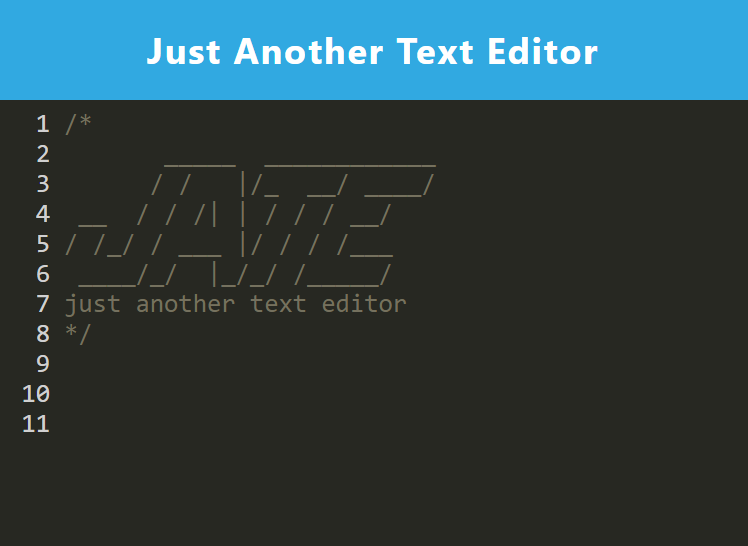

# PWA-Text-Editor

   
  
  https://pwa-text-editor-ia80.onrender.com/

  ## Description
  A text editor that runs in the browser and uses JavaScript syntax highlighting.

  

  ## Table of Contents
  [Usage](#usage)  
  [License](#license)  
  [Contributing](#contributing)  
  [Questions](#questions) 
  [Credit](#credit)
  
  
  ## Usage
  A text editor you can use in the browser and download to your PC that uses JavaScript syntax highlighting!
  
  ## License

This application uses the MIT license: https://opensource.org/licenses/MIT

  ## Contributing
  Please fork the repository, make your edits, and then request to merge back to the main project.

  
  ## Questions
  If you have any questions, please contact me:  
  <a href="https://github.com/mikedaleo">GitHub</a>  
  or  
  Email: mikejdaleo@gmail.com
  